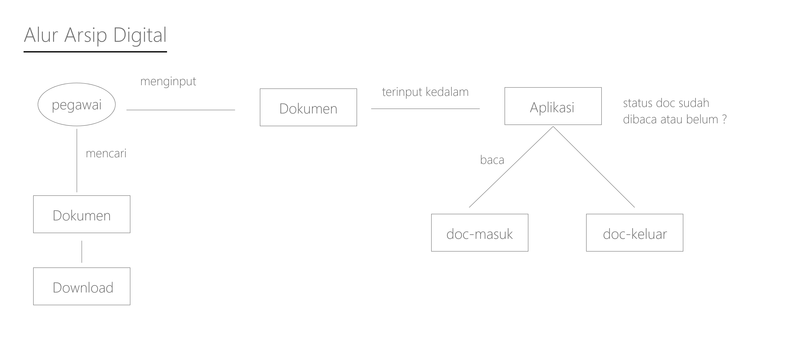
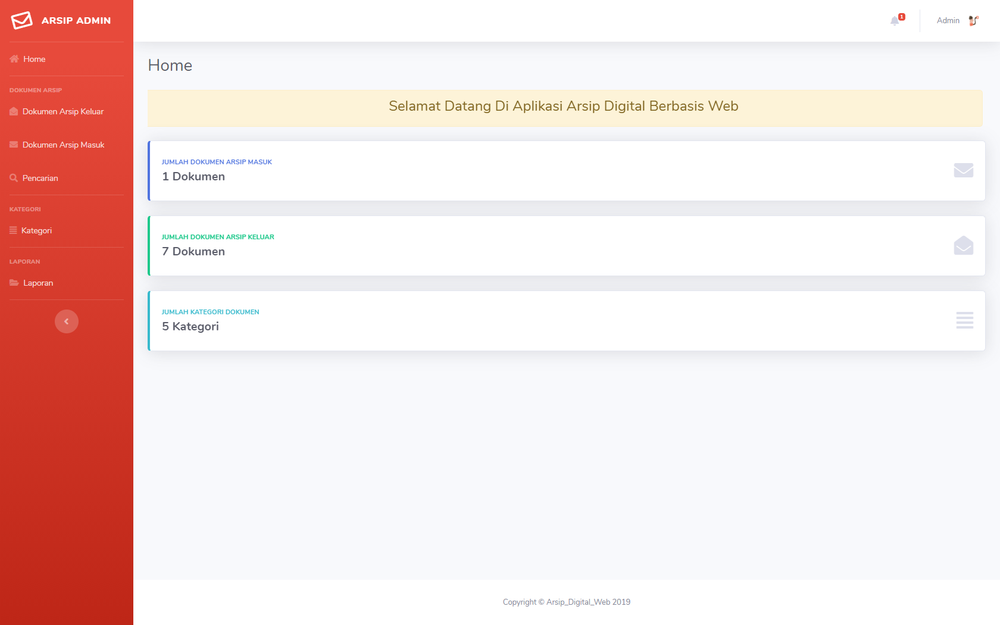
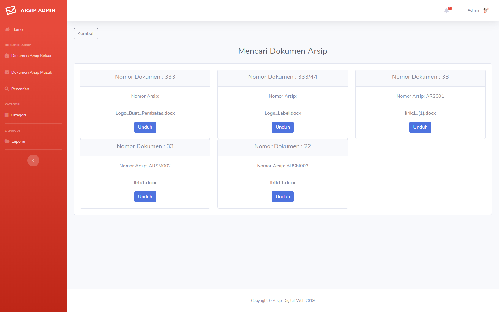
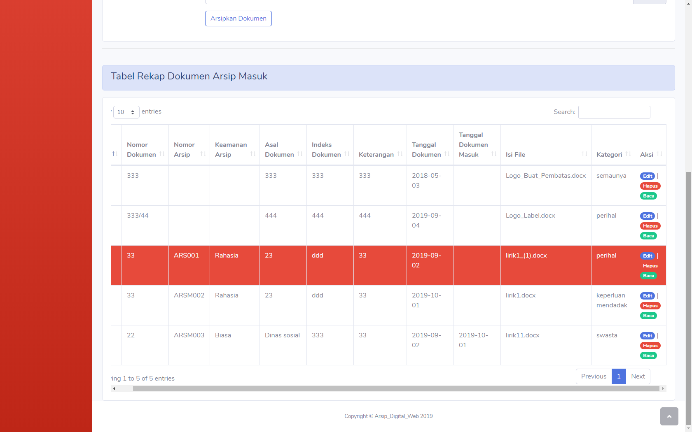

# Selamat Datang Di Aplikasi Arsip Digital

Aplikasi ini adalah Aplikasi Pengarsipan data secara Digital, yang dipelopori oleh KangR dan dibuat untuk menyelesaikan tugas
kuliah yaitu untuk memudahkan dalam hal pengarsipan dan juga memudahkan mencari document tersebut.

Aplikasi ini dibuat menggunakan :
  1. PHP Codeigniter 3
  2. CSS Boostrap 3
  3. Template SB Admin 2
  4. Beberapa Plugin seperti js datepicker, fpdf untuk laporan, datatables boostrap dan lain lain

Gambaran dari alur aplikasi ini adalah : 

Gambaran dari aplikasi ini ialah dibawah ini

 

 

Aplikasi ini baru mencapai tahap awal setelah selesai dibuat atau lebih tepatnya :
- arsip_digital v.1 (sampai saat ini)
